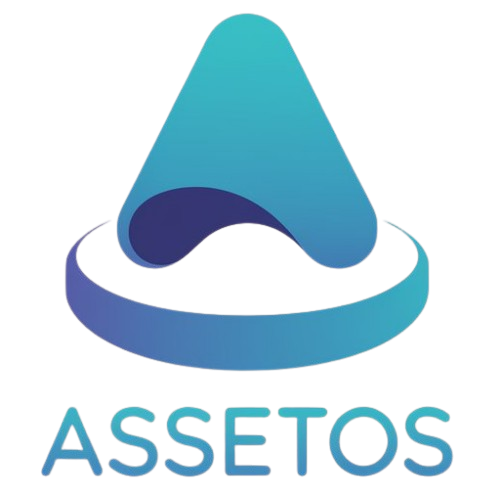

# AssetOS - Open source item holding cost tracking system



AssetOS is an easy-to-use open source item holding cost tracking system that helps you easily manage and track the asset holding costs of individuals or companies. It supports multiple users and multiple languages, and provides rich statistical analysis functions.

[中文文档](https://github.com/DsTansice/AssetOS/blob/main/README_zh.md)
## ✨ Main functions

- 📊 **Asset management**: Add, edit, and delete asset information, and support multiple status management
- 💰 **Cost tracking**: Automatically calculate daily holding costs and accurately grasp asset value changes
- 📈 **Statistical reports**: Rich charts and analysis reports, data visualization
- 📤 **Data import and export**: Support CSV format batch import and export for easy data migration
- 👥 **User management**: Multi-user support, complete permission control system
- 🔧 **System settings**: Custom classification, SMTP mail configuration, Webhook integration
- 🌐 **Multi-language support**: Chinese/English interface, support language expansion
- 🔒 **Security protection**: Complete user authentication and data security protection

## 🚀 Quick Start

### ⚡ One-Click Deployment (Fastest)

**🎯 Super Quick Start - Choose your preferred method:**

```bash
# Method 1: One-line curl deployment
curl -fsSL https://raw.githubusercontent.com/DsTansice/AssetOS/main/quick-deploy.sh | bash

# Method 2: Direct Docker Hub pull & run
docker run -d --name assetOS -p 8080:80 -v assetOS-data:/var/www/html/db --restart unless-stopped dstansice/assetos:latest

# Method 3: With custom data directory
mkdir my-assetos-data && docker run -d --name assetOS -p 8080:80 -v $(pwd)/my-assetos-data:/var/www/html/db --restart unless-stopped dstansice/assetos:latest
```

**🔧 Custom deployment options:**
```bash
# Use different port (e.g., 3000)
docker run -d --name assetOS -p 3000:80 -v assetOS-data:/var/www/html/db --restart unless-stopped dstansice/assetos:latest

# With backup directory
docker run -d --name assetOS -p 8080:80 -v assetOS-data:/var/www/html/db -v assetOS-backups:/var/www/html/backups --restart unless-stopped dstansice/assetos:latest

# Check deployment status
docker ps | grep assetOS && echo "✅ AssetOS is running at: http://localhost:8080"
```

**📱 After deployment:**
1. 🌐 Visit: `http://localhost:8080`
2. 👤 Register first user (becomes admin)
3. 🎉 Start tracking your assets!

---

### Method 1: Docker deployment (recommended)

#### Using Docker Compose (easiest)

1. Create a project directory:
```bash
mkdir assetOS && cd assetOS
```

2. Create a `docker-compose.yml` file:
```yaml
version: '3.8'
   
   services:
     assetos:
       image: tans0008/assetos:latest
       container_name: assetOS
       ports:
         - "8080:80"
       volumes:
         - ./src:/var/www/html
         - ./data:/var/www/html/db
       environment:
         - APACHE_DOCUMENT_ROOT=/var/www/html
       restart: unless-stopped
       command: >
         bash -c "
         apt-get update &&
         apt-get install -y sqlite3 libsqlite3-dev &&
         docker-php-ext-install pdo pdo_sqlite &&
         apache2-foreground
         "
   ```

3. Clone the project code:
```bash
git clone https://github.com/DsTansice/AssetOS.git src
mkdir data
chmod 755 data
```

4. Start the container:
```bash
docker-compose up -d
```

5. Visit `http://localhost:8080` to start using

#### Direct deployment using Docker
```bash
# Pull code
git clone https://github.com/DsTansice/AssetOS.git
cd AssetOS

# Create a data directory
mkdir data
chmod 755 data

# Build and run the container
docker run -d \
  --name assetOS \
  -p 8080:80 \
  -v $(pwd):/var/www/html \
  -v $(pwd)/data:/var/www/html/db \
  --restart unless-stopped \
  tans0008/assetos:latest

# Install the SQLite extension
docker exec assetOS bash -c "apt-get update && apt-get install -y sqlite3 libsqlite3-dev && docker-php-ext-install pdo pdo_sqlite"

# Restart the container to make the extension take effect
docker restart assetOS
```

### Method 2: Traditional deployment

#### Environment requirements
- PHP 7.4 or higher
- SQLite 3 extension
- Web server (Apache/Nginx or PHP built-in server)

#### Installation steps

1. Clone the project:
   ```bash
   git clone https://github.com/DsTansice/AssetOS.git
   cd AssetOS
   ```

2. Create a database directory:
```bash
mkdir db
chmod 755 db
```

3. Configure a web server or use the PHP built-in server:
```bash
# Use the PHP built-in server (development environment)
php -S localhost:8000

# Or configure Apache/Nginx to point to the project root directory
```

4. Access the application and register the first user (automatically becomes an administrator)

## 📁 Directory structure

```
AssetOS/
├── api/ # API interface
│ └── api.php
├── asset/ # Static resources
│ ├── logo.png
│ └── favicon.ico
├── css/ # Style file
│ └── styles.css
├── db/ # Database file directory
├── includes/ # Public components
│ ├── footer.php
│ └── url_encoder.php
├── js/ # JavaScript file
│ ├── script.js
│ ├── theme-toggle.js
│ └── user-dropdown.js
├── admin.php # Administrator panel
├── index.php # Asset list page
├── login.php # Login page
├── register.php # Registration page
├── menu.php # Main menu
├── manage.php # Asset management page
├── reports.php # Statistics report page
├── settings.php # Personal settings page
├── sponsor.php # Sponsorship page
├── version.php # Version information
├── docker-compose.yml # Docker orchestration file
└── README.md # Project description
```

## 🔧 Detailed Function

### 📊 Asset Management
- **Add Asset**: Supports name, category, purchase date, price and other information entry
- **Status Management**: In use, discarded, transferred, damaged and other status
- **Batch Operation**: Batch import and export in CSV format, support large-scale data processing
- **Classification Management**: Customize asset classification and flexibly organize asset structure

### 📈 Statistical Analysis
- **Real-time Statistics**: Real-time calculation of total asset quantity, value and holding cost
- **Chart Display**: Classification distribution, status analysis, trend chart
- **Cost Analysis**: Daily holding cost, monthly expenditure trend analysis
- **Data Export**: Statistical reports support multiple formats for export

### 👥 Users and Permissions
- **Multi-user Support**: Supports multiple users to manage assets independently
- **Permission Classification**: Separation of administrator and ordinary user permissions
- **Security Authentication**: Complete login authentication and session management

### ⚙️ System Configuration
- **Theme Switch**: Freely switch between light and dark themes
- **Language Settings**: Switch between Chinese and English interfaces
- **Mail Configuration**: SMTP mail service configuration
- **Webhook**: Support third-party system integration

## 🛠 Technology Stack

- **Backend Framework**: PHP 8.1+
- **Database**: SQLite 3
- **Front-end Technology**: HTML5 + CSS3 + JavaScript (ES6+)
- **UI Framework**: Tailwind CSS
- **Containerization**: Docker + Docker Compose
- **Version Control**: Git

## 🔒 Security Features

- SQL Injection Protection
- XSS Attack Protection
- CSRF Token Validation
- User Session Management
- Password Encryption Storage
- File Upload Security Check

## 🤝 Contribution Guide

We welcome all forms of contributions! Whether you are a developer, designer or user, you can contribute to the project:

### Contribution methods
- 🐛 **Bug Report**: Please provide feedback if you find any problems
- 💡 **Feature Suggestions**: Propose new features or improvement suggestions
- 📖 **Document Improvement**: Help improve documentation and usage guides
- 🔧 **Code Contribution**: Submit code fixes or new features
- 🌐 **Multilingual**: Help translate the interface to more languages
- 🎨 **Design Optimization**: Suggest UI/UX design improvements

### Development process
1. Fork this project to your GitHub account
2. Create a feature branch: `git checkout -b feature/your-feature-name`
3. Commit changes: `git commit -m 'Add some feature'`
4. Push branch: `git push origin feature/your-feature-name`
5. Create a Pull Request

### Development environment setup
```bash
# Clone your forked repository
git clone https://github.com/YOUR_USERNAME/AssetOS.git
cd AssetOS

# Use Docker to quickly build a development environment
docker-compose up -d

# Or use the traditional method
php -S localhost:8000
```

## 📜 Open Source License

This project adopts the dual licensing model of **GPL-3.0 + Commercial License**:

- **Open Source Use**: Follow the GPL-3.0 license and can be used, modified and distributed freely

- **Commercial License**: For corporate commercial use, please contact to obtain a commercial license

### Commercial License Contact Information
- 📧 **Email**: admin@010085.xyz
- 📋 Please email for detailed licensing terms

## 💬 Community Exchange

Join our community to get the latest updates and technical support:

- 💬 **Telegram Exchange Group**: [https://t.me/AssetOSOffical](https://t.me/AssetOSOffical)
- 📢 **Telegram Channel**: [https://t.me/OPAssetOS](https://t.me/OPAssetOS)
- 🐛 **GitHub Issues**: [Issue feedback](https://github.com/DsTansice/AssetOS/issues)
- 📖 **Project documentation**: [Usage documentation](https://github.com/DsTansice/AssetOS/wiki)
## ❤️ Support the project

If AssetOS is helpful to you, please consider supporting the project development:

- ⭐ **GitHub Star**: Give the project a star
- 🔄 **Share and recommend**: Recommend to more friends in need
- 🐛 **Feedback and suggestions**: Help us find and fix problems
- 💰 **Sponsorship support**: 
- 🤝 **Code contribution**: Participate in the development to make the project better

## 🔗 Related links

- 🏠 **Project homepage**: [GitHub Repository](https://github.com/DsTansice/AssetOS)
- 🐛 **Issue feedback**: [Issues](https://github.com/DsTansice/AssetOS/issues)
- 📖 **Usage documentation**: [Wiki](https://github.com/DsTansice/AssetOS/wiki)
- 📋 **Changelog**: [CHANGELOG.md](CHANGELOG.md)
- 💬 **Discussions**: [GitHub Discussions](https://github.com/DsTansice/AssetOS/discussions)

## 📊 Project Status


---

<div align="center">

**© 2025 [DsTansice](https://github.com/DsTansice) - AssetOS 开源物品持有成本追踪系统**

*让资产管理变得简单高效* ✨

</div>
