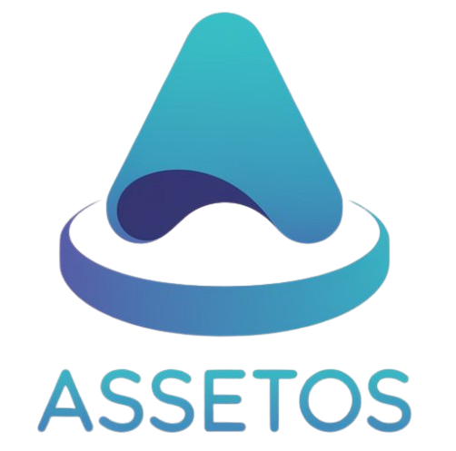

# AssetOS - 开源物品持有成本追踪系统



AssetOS 是一个简单易用的开源物品持有成本追踪系统，帮助您轻松管理和追踪个人或企业的资产持有成本。支持多用户、多语言，提供丰富的统计分析功能。

## ✨ 主要功能

- 📊 **资产管理**: 添加、编辑、删除资产信息，支持多种状态管理
- 💰 **成本追踪**: 自动计算每日持有成本，精准掌握资产价值变化
- 📈 **统计报告**: 丰富的图表和分析报告，数据可视化展示
- 📤 **数据导入导出**: 支持 CSV 格式批量导入导出，便于数据迁移
- 👥 **用户管理**: 多用户支持，完善的权限控制体系
- 🔧 **系统设置**: 自定义分类、SMTP 邮件配置、Webhook 集成
- 🌐 **多语言支持**: 中文/英文界面，支持语言扩展
- 🔒 **安全防护**: 完善的用户认证和数据安全保护

## 🚀 快速开始

### 方式一：Docker 部署（推荐）

#### 使用 Docker Compose（最简单）

1. 创建项目目录：
   ```bash
   mkdir assetOS && cd assetOS
   ```

2. 创建 `docker-compose.yml` 文件：
   ```yaml
   version: '3.8'
   
   services:
     assetos:
       image: php:8.2-apache
       container_name: assetOS
       ports:
         - "8080:80"
       volumes:
         - ./src:/var/www/html
         - ./data:/var/www/html/db
       environment:
         - APACHE_DOCUMENT_ROOT=/var/www/html
       restart: unless-stopped
       command: >
         bash -c "
         apt-get update &&
         apt-get install -y sqlite3 libsqlite3-dev &&
         docker-php-ext-install pdo pdo_sqlite &&
         apache2-foreground
         "
   ```

3. 克隆项目代码：
   ```bash
   git clone https://github.com/DsTansice/AssetOS.git src
   mkdir data
   chmod 755 data
   ```

4. 启动容器：
   ```bash
   docker-compose up -d
   ```

5. 访问 `http://localhost:8080` 开始使用

#### 使用 Docker 直接部署

```bash
# 拉取代码
git clone https://github.com/DsTansice/AssetOS.git
cd AssetOS

# 创建数据目录
mkdir data
chmod 755 data

# 构建并运行容器
docker run -d \
  --name assetOS \
  -p 8080:80 \
  -v $(pwd):/var/www/html \
  -v $(pwd)/data:/var/www/html/db \
  --restart unless-stopped \
  php:8.1-apache

# 安装 SQLite 扩展
docker exec assetOS bash -c "apt-get update && apt-get install -y sqlite3 libsqlite3-dev && docker-php-ext-install pdo pdo_sqlite"

# 重启容器使扩展生效
docker restart assetOS
```

### 方式二：传统部署

#### 环境要求
- PHP 7.4 或更高版本
- SQLite 3 扩展
- Web 服务器（Apache/Nginx 或 PHP 内置服务器）

#### 安装步骤

1. 克隆项目：
   ```bash
   git clone https://github.com/DsTansice/AssetOS.git
   cd AssetOS
   ```

2. 创建数据库目录：
   ```bash
   mkdir db
   chmod 755 db
   ```

3. 配置 Web 服务器或使用 PHP 内置服务器：
   ```bash
   # 使用 PHP 内置服务器（开发环境）
   php -S localhost:8000
   
   # 或配置 Apache/Nginx 指向项目根目录
   ```

4. 访问应用并注册第一个用户（自动成为管理员）

## 📁 目录结构

```
AssetOS/
├── api/                # API 接口
│   └── api.php
├── asset/              # 静态资源
│   ├── logo.png
│   └── favicon.ico
├── css/                # 样式文件
│   └── styles.css
├── db/                 # 数据库文件目录
├── includes/           # 公共组件
│   ├── footer.php
│   └── url_encoder.php
├── js/                 # JavaScript 文件
│   ├── script.js
│   ├── theme-toggle.js
│   └── user-dropdown.js
├── admin.php           # 管理员面板
├── index.php           # 资产列表页面
├── login.php           # 登录页面
├── register.php        # 注册页面
├── menu.php            # 主菜单
├── manage.php          # 资产管理页面
├── reports.php         # 统计报告页面
├── settings.php        # 个人设置页面
├── sponsor.php         # 赞助页面
├── version.php         # 版本信息
├── docker-compose.yml  # Docker 编排文件
└── README.md           # 项目说明
```

## 🔧 功能详解

### 📊 资产管理
- **添加资产**: 支持名称、分类、购买日期、价格等信息录入
- **状态管理**: 在用、已丢弃、已转手、已损坏等多种状态
- **批量操作**: CSV 格式批量导入导出，支持大量数据处理
- **分类管理**: 自定义资产分类，灵活组织资产结构

### 📈 统计分析
- **实时统计**: 总资产数量、价值、持有成本实时计算
- **图表展示**: 分类分布、状态分析、趋势图表
- **成本分析**: 每日持有成本、月度支出趋势分析
- **数据导出**: 统计报告支持多种格式导出

### 👥 用户与权限
- **多用户支持**: 支持多个用户独立管理资产
- **权限分级**: 管理员、普通用户权限分离
- **安全认证**: 完善的登录认证和会话管理

### ⚙️ 系统配置
- **主题切换**: 明暗主题自由切换
- **语言设置**: 中英文界面切换
- **邮件配置**: SMTP 邮件服务配置
- **Webhook**: 支持第三方系统集成

## 🛠 技术栈

- **后端框架**: PHP 8.1+ 
- **数据库**: SQLite 3
- **前端技术**: HTML5 + CSS3 + JavaScript (ES6+)
- **UI 框架**: Tailwind CSS
- **容器化**: Docker + Docker Compose
- **版本控制**: Git

## 🔒 安全特性

- SQL 注入防护
- XSS 攻击防护  
- CSRF 令牌验证
- 用户会话管理
- 密码加密存储
- 文件上传安全检查

## 🤝 贡献指南

我们欢迎所有形式的贡献！无论您是开发者、设计师还是用户，都可以为项目做出贡献：

### 贡献方式
- 🐛 **报告 Bug**: 发现问题请及时反馈
- 💡 **功能建议**: 提出新功能或改进建议  
- 📖 **文档完善**: 帮助改进文档和使用指南
- 🔧 **代码贡献**: 提交代码修复或新功能
- 🌐 **多语言**: 帮助翻译界面到更多语言
- 🎨 **设计优化**: UI/UX 设计改进建议

### 开发流程
1. Fork 本项目到您的 GitHub 账户
2. 创建特性分支: `git checkout -b feature/your-feature-name`
3. 提交更改: `git commit -m 'Add some feature'`
4. 推送分支: `git push origin feature/your-feature-name`
5. 创建 Pull Request

### 开发环境搭建
```bash
# 克隆您 fork 的仓库
git clone https://github.com/YOUR_USERNAME/AssetOS.git
cd AssetOS

# 使用 Docker 快速搭建开发环境
docker-compose up -d

# 或使用传统方式
php -S localhost:8000
```

## 📜 开源许可

本项目采用 **GPL-3.0 + 商业许可** 双重许可模式：

- **开源使用**: 遵循 GPL-3.0 许可证，可自由使用、修改和分发
- **商业许可**: 企业商业使用请联系获取商业许可

### 商业许可联系方式
- 📧 **邮箱**: admin@010085.xyz
- 📋 详细授权条款请邮件咨询

## 💬 社区交流

加入我们的社区，获取最新更新和技术支持：

- 💬 **Telegram 交流群**: [https://t.me/AssetOSOffical](https://t.me/AssetOSOffical)
- 📢 **Telegram 频道**: [https://t.me/OPAssetOS](https://t.me/OPAssetOS)  
- 🐛 **GitHub Issues**: [问题反馈](https://github.com/DsTansice/AssetOS/issues)
- 📖 **项目文档**: [使用文档](https://github.com/DsTansice/AssetOS/wiki)

## ❤️ 支持项目

如果 AssetOS 对您有帮助，请考虑支持项目发展：

- ⭐ **GitHub Star**: 给项目点个 Star
- 🔄 **分享推荐**: 推荐给更多需要的朋友
- 🐛 **反馈建议**: 帮助我们发现和修复问题
- 💰 **赞助支持**: 
- 🤝 **代码贡献**: 参与开发让项目更完善

## 🔗 相关链接

- 🏠 **项目主页**: [GitHub Repository](https://github.com/DsTansice/AssetOS)
- 🐛 **问题反馈**: [Issues](https://github.com/DsTansice/AssetOS/issues)  
- 📖 **使用文档**: [Wiki](https://github.com/DsTansice/AssetOS/wiki)
- 📋 **更新日志**: [CHANGELOG.md](CHANGELOG.md)
- 💬 **讨论区**: [GitHub Discussions](https://github.com/DsTansice/AssetOS/discussions)

## 📊 项目状态


---

<div align="center">

**© 2025 [DsTansice](https://github.com/DsTansice) - AssetOS 开源物品持有成本追踪系统**

*让资产管理变得简单高效* ✨

</div>
